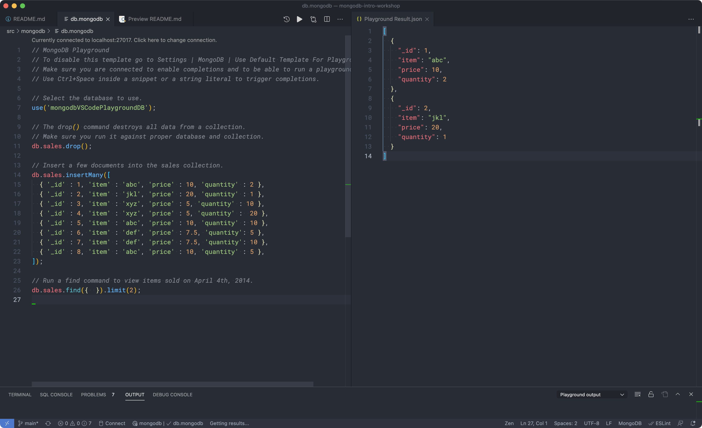
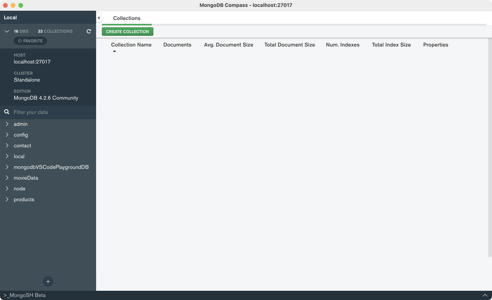

`mongodb` `#assembler-school` `#master-in-software-engineering`

# Assembler School: Node.js REST API Design Intro Workshop <!-- omit in toc -->

In this workshop you will learn how to build a REST API with Node.js, MongoDB and Mongoose.

## Table of Contents <!-- omit in toc -->

- [Getting Started](#getting-started)
- [Workshop Material](#workshop-material)
- [Dependencies](#dependencies)
- [Contents and Branches Naming Strategy](#contents-and-branches-naming-strategy)
- [Refresher](#refresher)
- [REST APIs in Node.js](#rest-apis-in-nodejs)
- [Starting the Server](#starting-the-server)
- [Defining Routes and Controllers](#defining-routes-and-controllers)
- [Getting a Single Resource](#getting-a-single-resource)
- [Creating Resources](#creating-resources)
- [Updating Resources](#updating-resources)
- [Deleting a Resource](#deleting-a-resource)
- [CRUD API Exercises](#crud-api-exercises)

## Getting Started

### The repo

First, you will need to clone the repo:

```bash
$ git clone https://github.com/assembler-school/nodejs-rest-api-design-intro-workshop.git
```

## Workshop Material

- [Slides](https://docs.google.com/presentation/d/1LlM87-YozYFv6cuU6oEPFPTqLGrumpWJ29-EaJKOq9E/edit?usp=sharing)

## Dependencies

Before we can get started you will need to make sure that all the necessary dependencies are installed in your system.

### Node.js

You can install it by following the instructions [in the official docs](https://nodejs.org/en/) (we recommend that you install the version that is named _Current_).

To verify that you have installed it correctly, you can run the following command from the terminal that should output the version installed:

```bash
$ node --version
v15.5.0
```

### MongoDB

You find the instructions on installing the MongoDB Community Server locally in the [official docs](https://www.mongodb.com/try/download/community).

To verify that you have installed it correctly, you can run the following command from the terminal which should open the mongodb shell:

```bash
$ mongo
MongoDB shell version v4.2.6
connecting to: mongodb://127.0.0.1:27017/?compressors=disabled&gssapiServiceName=mongodb
Implicit session: session { "id" : UUID("5087a5c3-90ae-4a3b-8039-4a9cec0baa21") }
MongoDB server version: 4.2.6
Server has startup warnings:
2020-11-29T08:34:35.711+0100 I  CONTROL  [initandlisten]
2020-11-29T08:34:35.712+0100 I  CONTROL  [initandlisten] ** WARNING: Access control is not enabled for the database.
2020-11-29T08:34:35.712+0100 I  CONTROL  [initandlisten] **          Read and write access to data and configuration is unrestricted.
2020-11-29T08:34:35.739+0100 I  CONTROL  [initandlisten]
---
Enable MongoDB's free cloud-based monitoring service, which will then receive and display
metrics about your deployment (disk utilization, CPU, operation statistics, etc).

The monitoring data will be available on a MongoDB website with a unique URL accessible to you
and anyone you share the URL with. MongoDB may use this information to make product
improvements and to suggest MongoDB products and deployment options to you.

To enable free monitoring, run the following command: db.enableFreeMonitoring()
To permanently disable this reminder, run the following command: db.disableFreeMonitoring()
---

>
```

### MongoDB for VS Code Extension

Furthermore, you can also install the MongoDB for VS Code extension for an easier integration inside VS Code. You can learn more in the [official docs](https://docs.mongodb.com/mongodb-vscode/).



### MongoDB Compass

For this workshop you should have installed MongoDB Compass which is the official GUI tool for working with MongoDB databases. Your can lean how to install it in the [official docs](https://www.mongodb.com/products/compass).



### Heroku CLI

In order to be able to keep up with the workshop you will need to have previously installed the Heroku CLI.

Follow the instructions in the [official docs](https://devcenter.heroku.com/articles/heroku-cli) and make sure that it is working before the day of the workshop.

To verify that it works run the following command from the terminal:

```bash
$ heroku --version
```

### Project Dependencies

Then, you will have to install all the project dependencies with npm in the root folder:

```bash
$ npm install
```

## Contents and Branches Naming Strategy

The repository is made up of several branches that include the contents and exercises of each section.

The branches follow a naming strategy like the following:

- `{NN}-exercise`: includes the main contents and the instructions of the exercises
- `{NN}-exercise-solution`: includes the solution of the exercises

### Fetch all Branches

In order to fetch all the remote branches in the repository you can use the following command:

```bash
$ git fetch --all

# List both remote-tracking branches and local branches
$ git branch --all
```

Then, you can create a local branch based on a remote branch with the following command:

```bash
$ git checkout -b <new_branch_name> <remote_branch_name>
```

## Refresher

### Node.js MVC Folder Structure

Following the MVC pattern, this is a sample folder structure for developing backend applications using the MERN Stack.

#### What is the _MERN_ Stack?

_MERN_ stands for MongoDB, Express, React, Node, after the four key technologies that make up the stack.

- **MongoDB** - document database
- **Express.js** - Node.js web framework
- **React.js** - a client-side JavaScript framework
- **Node.js** - the premier JavaScript web server

```bash
├── ...
└── src
    ├── config
    │   └── ...\.js
    ├── controllers
    │   └── user-controller.js
    │   └── X-controller.js
    ├── db
    │   └── ...\.js
    ├── middleware
    │   └── X-middleware.js
    ├── models
    │   ├── index.js
    │   └── user-model.js
    │   └── X-model.js
    ├── routes
    │   └── user-routes.js
    │   └── X-routes.js
    ├── index.js
    └── server.js
```

### Folders Used

#### `controllers`

Where we store the controllers used in the routes. These are responsible for return a response for each endpoint, usually they connect to the DB and fetch the data from it.

#### `routes`

Where we store the routes used in the endpoints of the app.

#### `models`

Where we store the mongoose models of the app.

### Other Folder

#### `config`

Where we can store all the configuration files needed in the app.

#### `middleware`

Where we can store the middleware used in the app.

#### `db`

Where we can store the files related to the database.

#### `server.js`

The file that holds the express.js `app` exported for use in the `index.js` file and for easier testing.

#### `index.js`

### DB Design

In this workshop we will continue with the mongoose models from the previous MongoDB Intro Workshop.

The models we will use are the following:

#### User Model

```js
const UserSchema = new mongoose.Schema(
  {
    firstName: {
      type: String,
      required: [true, "The first name is required"],
      trim: true,
    },
    lastName: {
      type: String,
      required: [true, "The last name is required"],
      trim: true,
    },
    email: {
      type: String,
      required: [true, "The email is required"],
      trim: true,
      unique: true,
      validate: {
        validator: (value) => validator.isEmail(value),
        message: (props) => `The email ${props.value} is not valid`,
      },
    },
    password: {
      type: String,
      required: [true, "The password is required"],
      minlength: [8, "The password is too short"],
    },
    speaks: [
      {
        type: String,
        enum: [
          "english",
          "spanish",
          "catalan",
          "german",
          "italian",
          "javascript",
        ],
      },
    ],
  },
  { timestamps: true },
);
```

#### Song Model

```js
const SongSchema = new mongoose.Schema(
  {
    name: {
      type: String,
      required: true,
      trim: true,
    },
    genre: {
      type: String,
      required: true,
      trim: true,
    },
    duration: {
      type: Number,
      required: true,
    },
    stats: {
      type: Object,
      default: {
        timesPlayed: 0,
        upVotes: 0,
        downVotes: 0,
      },
      timesPlayed: Number,
      upVotes: Number,
      downVotes: Number,
    },
    author: {
      type: mongoose.SchemaTypes.ObjectId,
      required: true,
      ref: "user",
    },
  },
  { timestamps: true },
);
```

## REST APIs in Node.js

Building a REST API with Node.js is very easy. We just need to define an endpoint with express and return a response. However, this is very limited because usually we need a database to store and retrieve data from.

But now that we know how to use Mongoose we can connect it to express so that we can perform CRUD operations with it.

## Starting the Server

As we have seen in the previous workshop, we first need to connect to the database and then we can start the express server:

```js
// src/index.js
const app = require("./server");
const config = require("./config/config");
const connect = require("./db/connect");

// uncomment if you need to seed the database before
// const { seedUsers } = require("./db/seed");

connect().then(async function onServerInit() {
  config.logger.info(`DB connected`);

  // uncomment if you need to seed the database before
  // await seedUsers();

  app.listen(config.app.PORT, () => {
    config.logger.info(`Server running at http://localhost:${config.app.PORT}`);
  });
});
```

Then, we can define a basic endpoint with express to return a response for each request:

```js
const express = require("express");
const helmet = require("helmet");
const morgan = require("morgan");
const { json } = require("body-parser");

const app = express();

app.use(morgan("dev"));
app.use(helmet());
app.use(json());

app.get("/", (req, res) => {
  res.status(200).send({
    data: "hello-world",
  });
});

module.exports = app;
```

If we make a request to the `http://localhost:4000` endpoint we should get a response:

```json
{
  "data": "hello-world"
}
```

## Defining Routes and Controllers

In order to use the MVC design pattern we can create routes and controllers in our app. First, we need to create the controllers that will responsible for responding to each request:

```js
const db = require("../models");

async function getUsers(req, res, next) {
  try {
    const users = await db.User.find({})
      .select({
        firstName: 1,
        lastName: 1,
      })
      .limit(10)
      .lean()
      .exec();

    res.status(200).send({
      data: users,
    });
  } catch (error) {
    next(error);
  }
}

module.exports = {
  getUsers: getUsers,
};
```

Then, we need to create the router:

```js
const Router = require("express").Router;

const userController = require("../controllers/user-controller");

const UserRouter = Router();

UserRouter.get("/", userController.getUsers);

module.exports = UserRouter;
```

Then, instead of handling the response in the `server.js` file, we use the controllers that are defined as middleware in the router.

```js
app.use("/users", UserRouter);
```

Now, if we make a request to the `/users` endpoint we should see the following response:

```json
{
  "data": [
    {
      "_id": "5ff1912e6db1cb02e81694c0",
      "firstName": "Jordan",
      "lastName": "Peterson"
    },
    {
      "_id": "5ff1912e6db1cb02e81694c2",
      "firstName": "Mable",
      "lastName": "Schneider"
    },
    {
      "_id": "5ff1912e6db1cb02e81694c1",
      "firstName": "Margaret",
      "lastName": "Watkins"
    },
    {
      "_id": "5ff1912e6db1cb02e81694c3",
      "firstName": "Alta",
      "lastName": "Harris"
    },
    {
      "_id": "5ff1912e6db1cb02e81694c4",
      "firstName": "Darrell",
      "lastName": "Wilkerson"
    },
    {
      "_id": "5ff1912e6db1cb02e81694c5",
      "firstName": "Ryan",
      "lastName": "McGuire"
    }
  ]
}
```

## Getting a Single Resource

In order to get a single resource we can use route params. In this case we can get the details of a single user using the `req.params` property.

```js
// src/routes/user-routes.js
UserRouter.get("/:userId", userController.getUserDetails);
```

Then, we can define the controller that fetches the info of the user with the id that we pass.

```js
// src/routes/user-controller.js
async function getUserDetails(req, res, next) {
  const { userId } = req.params;

  try {
    const user = await db.User.findOne({
      _id: userId,
    })
      .select("-password -__v -createdAt -updatedAt")
      .lean()
      .exec();

    res.status(200).send({
      data: user,
    });
  } catch (error) {
    next(error);
  }
}
```

Then, we can make a request to the endpoint and we should see the following response:

```bash
http GET localhost:4000/users/5ffa0520791f51190117e5c7
```

```json
{
  "data": {
    "_id": "5ffa0520791f51190117e5c7",
    "email": "ba@wuf.ws",
    "firstName": "Mable",
    "lastName": "Schneider",
    "speaks": ["german", "english"]
  }
}
```

## Creating Resources

In order to create a resource we can simply define a `POST` handler and the controller that stores the information in the database.

```js
// src/routes/user-routes.js
UserRouter.post("/", userController.createUser);
```

All the information we send, in this case in json format, will be available in the `req.body` property because we are using the `express.json()` middleware.

```js
// src/routes/user-controller.js
async function createUser(req, res, next) {
  const { firstName, lastName, email, password, speaks } = req.body;

  try {
    const user = await db.User.create({
      firstName,
      lastName,
      email,
      password,
      speaks,
    });

    res.status(200).send({
      data: {
        _id: user._id,
        firstName: user.firstName,
        lastName: user.lastName,
        email: user.email,
        speaks: user.speaks,
      },
    });
  } catch (error) {
    next(error);
  }
}
```

Then, we can send a `POST` request with the following `JSON` data:

```json
{
  "firstName": "Jordan",
  "lastName": "Peterson",
  "email": "person_2@mail.com",
  "password": "jordan-super-password",
  "speaks": ["english", "javascript"]
}
```

And we should receive a response similar to the following:

```json
{
  "data": {
    "_id": "5ffa0c6e102cad6d84be368f",
    "firstName": "Jordan",
    "lastName": "Peterson",
    "email": "person_2@mail.com",
    "speaks": ["english", "javascript"]
  }
}
```

## Updating Resources

In order to update a resource, we can create a `PATCH` handler and controller:

```js
// src/routes/user-routes.js
UserRouter.post("/", userController.createUser);
```

```js
// src/routes/user-controller.js
async function updateUser(req, res, next) {
  const { userId } = req.params;
  const { firstName, lastName } = req.body;

  try {
    const updatedUser = await db.User.findOneAndUpdate(
      {
        _id: userId,
      },
      {
        $set: {
          firstName: firstName,
          lastName: lastName,
        },
      },
      {
        new: true,
      },
    ).select({
      firstName: 1,
      lastName: 1,
    });

    res.status(200).send({
      data: updatedUser,
    });
  } catch (error) {
    next(error);
  }
}
```

Then, if we make a request with the `PATCH` HTTP Verb and we send the following data:

```json
{
  "firstName": "dani",
  "lastName": "assembler"
}
```

We should get a response:

```json
{
  "data": {
    "_id": "5ffa0520791f51190117e5ca",
    "firstName": "dani",
    "lastName": "assembler"
  }
}
```

## Deleting a Resource

In order to delete a resource we can follow the same logic, we need to define an endpoint in the router and a controller that handles the request.

```js
// src/routes/user-routes.js
UserRouter.delete("/:userId", userController.deleteUser);
```

```js
// src/routes/user-controller.js
async function deleteUser(req, res, next) {
  const { userId } = req.params;

  try {
    const result = await db.User.deleteOne({
      _id: userId,
    }).lean();

    if (result.ok === 1 && result.deletedCount === 1) {
      res.status(200).send({
        data: "User removed",
      });
    } else {
      res.status(500).send({
        data: "User not removed",
      });
    }
  } catch (error) {
    next(error);
  }
}
```

Then, if we make a request to the endpoint with the `DELETE` verb, we should get a response if the `userId` exists in the database.

## CRUD API Exercises

In this step we will create the CRUD endpoints for a Book schema that we have created for you. You will have to create endpoints and controllers so that you can create, read, modify and delete book resources.

The schema can be found in the `src/models/book-model.js` file.

### Seeding Users and Books

Before you get started, to make sure you have enough data in the database you can execute the `async seedBooks()` function from the `src/db/seed.js` file. This will remove all existing users and books and create new ones from scratch.

You can run the `seedBooks()` function in the `index.js` file when starting the server.

### Tests Suites

The test suites for these exercises can be executed with the following script: `npm run test:01:crud-api`.

Open the files indicated bellow and read the instructions and requirements of the tests to solve them.

- Once you are done the instructor will solve each step
- If you get stuck you can find the answers in the `01-crud-api-exercises-solution` branch
- Try not to peek at the solutions and solve them with your pair programming partner
- To finish this part you have 20 minutes

### 1. Create the books CRUD controllers in the `/src/routes/book-controllers.js` file

### 2. Create the books CRUD routes in the `/src/routes/book-routes.js` file

- **Test suite:** "books crud controllers"

## Author <!-- omit in toc -->

[Dani Lucaci](https://github.com/danilucaci)

## License <!-- omit in toc -->

[MIT](https://choosealicense.com/licenses/mit/)
